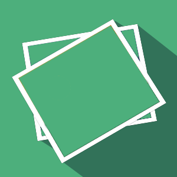
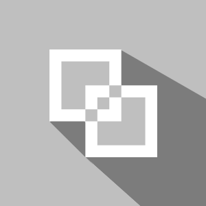

<h1>AbiPool</h1>
 <i>FlatIcons für die Webpage</i> 

<h2Julius</h2>

</img>
</img>
</img>
</img>
</img>
</img>
</img>
</img>
</img>
</img>
</img>

<h2>Youri</h2>

</img>
</img>
</img>
</img>
</img>